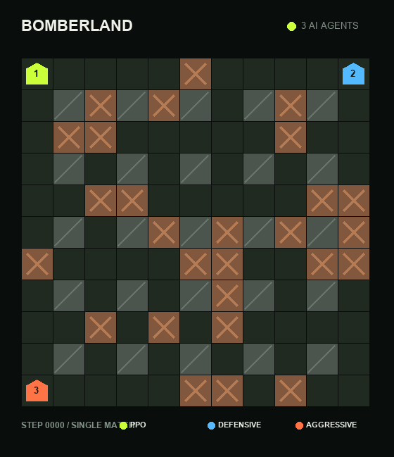

# Bomberland AI Agents

Dự án mô phỏng Bomberland gồm ba AI agent với ba chiến thuật khác nhau, được xây
dựng cho GDGoC AI Challenge.

- **Agent 1 — PPO Agent:** học bằng reinforcement learning, kết hợp safety shield.
- **Agent 2 — Defensive Agent:** phòng thủ, tính vùng nguy hiểm và tìm đường bằng BFS.
- **Agent 3 — Aggressive Agent:** chủ động săn đối thủ bằng A* và đặt bom gây áp lực.

## Video demo



## Kết quả đánh giá PPO

Agent 1 được đánh giá qua 30 trận đấu với Defensive Agent và Aggressive Agent.
Mỗi trận có tối đa 200 Step.

| Chỉ số | Kết quả |
|---|---:|
| Tỷ lệ thắng | **36,7%** — 11/30 trận |
| Tỷ lệ sống sót | **40%** — 12/30 trận |
| Điểm trung bình | **24,7** |
| Tổng hành động đặt bom | **178** |

Reward của PPO khuyến khích agent:

- Né bom và thoát khỏi vùng nguy hiểm.
- Phá thùng để mở đường.
- Tiếp cận và săn đối thủ.
- Chọn thời điểm đặt bom có mục tiêu.
- Sống sót và trở thành agent cuối cùng.

## Chạy đấu trường trên web

Cài đặt thư viện:

```bash
pip install -r requirements.txt
```

Khởi động web:

```bash
python app.py
```

Sau đó mở:

```text
http://127.0.0.1:8001
```

## Huấn luyện PPO

Huấn luyện model mới:

```bash
python train_ppo.py --matches 1000 --output bomberland_ppo.pt
```

Tiếp tục huấn luyện từ checkpoint hiện có:

```bash
python train_ppo.py --matches 500 --output bomberland_ppo.pt --resume
```

## Chạy engine trong terminal

```bash
python local_engine.py --steps 200 --show-map
```

## Tạo lại GIF demo

```bash
python record_demo.py
```
